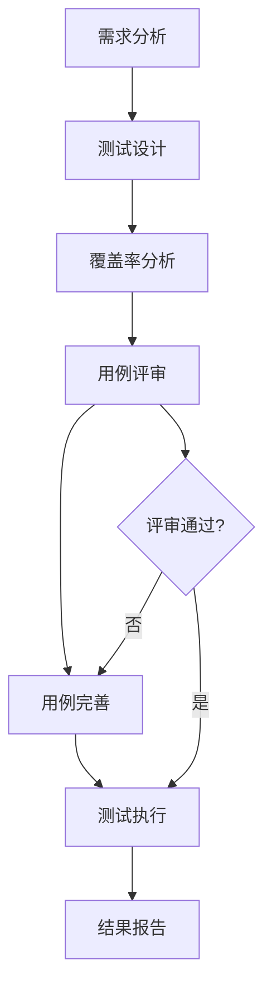

# 测试实践改进指南

## 1. 角色职责与边界

### 测试人员职责范围

#### ✅ 允许的行为
- **测试代码开发**: 编写、修改测试用例代码
- **测试配置**: 修改测试配置文件、测试数据
- **缺陷报告**: 创建详细的缺陷报告，包含重现步骤
- **覆盖率分析**: 分析测试覆盖率并提出改进建议
- **测试设计**: 设计测试用例，包括边界条件、异常场景

#### ❌ 禁止的行为
- **生产代码修改**: 禁止直接修改业务逻辑代码
- **核心架构变更**: 禁止修改系统架构或核心模块
- **数据库操作**: 禁止直接修改生产数据库结构或数据
- **系统配置**: 禁止修改生产环境配置

## 2. 测试覆盖率要求

### 2.1 测试设计阶段检查清单

#### 功能覆盖分析
- [ ] 所有需求规格说明书中的功能点是否覆盖
- [ ] 业务流程的所有分支是否测试
- [ ] 异常处理路径是否验证
- [ ] 边界值条件是否测试
- [ ] 性能和安全要求是否考虑

#### 代码覆盖要求
- **行覆盖率**: ≥ 80%
- **分支覆盖率**: ≥ 75%
- **函数覆盖率**: 100%
- **关键业务逻辑**: 100%

#### 测试类型覆盖
- [ ] 正常流程测试
- [ ] 异常流程测试
- [ ] 边界值测试
- [ ] 性能测试
- [ ] 安全测试
- [ ] 兼容性测试

### 2.2 测试用例完整性检查

#### 用例设计方法论
- **等价类划分**: 每个等价类至少一个测试用例
- **边界值分析**: 每个边界至少三个测试点(下界、边界、上界)
- **错误推测**: 基于经验设计错误场景
- **场景测试**: 基于用户使用场景设计用例

#### 用例文档要求
```markdown
## 测试用例模板

### 基础信息
- **用例ID**: TC_MODULE_001
- **功能模块**: 模块名称
- **优先级**: 高/中/低
- **设计人**: [提交者标识]

### 测试描述
- **测试目的**: 明确测试目标
- **前置条件**: 测试前需要满足的条件
- **测试步骤**: 详细的操作步骤
- **预期结果**: 期望的输出
- **实际结果**: 实际的输出(执行时填写)

### 覆盖分析
- **需求覆盖**: 涵盖的需求点
- **代码路径**: 涵盖的代码路径
- **风险等级**: 未覆盖此场景的风险评估
```

## 3. Commit标注规范

### 3.1 提交标识规范

#### 角色标识前缀
```bash
# 测试设计
[Test-张三] test: 添加模块A的边界值测试用例

# 测试执行  
[Test-李四] test: 执行模块B的回归测试，发现2个缺陷

# 缺陷修复验证
[Test-王五] test: 验证缺陷#123的修复情况

# 覆盖率分析
[Test-赵六] test: 完成模块C的覆盖率分析，缺失3个边界测试

# 测试报告
[Test-测试组长] test: 提交V1.2版本的测试总结报告
```

#### 提交类型分类
```bash
# 新增测试用例
test(feature): 新增XXX功能的测试用例
test(edge-case): 添加XXX的边界值测试
test(performance): 添加XXX的性能测试

# 修改测试用例  
test(fix): 修复XXX测试用例的断言错误
test(refactor): 重构XXX测试代码，提高可维护性

# 测试执行和报告
test(execution): 执行XXX回归测试
test(coverage): XXX模块的覆盖率分析报告
test(bug-report): 发现XXX缺陷，报告#123
```

### 3.2 禁止提交的文件模式

#### 测试人员禁止提交的文件列表
```gitignore
# 生产代码文件（除非添加测试相关注释）
/src/main/
/src/core/business/
/src/config/production/
/src/database/

# 只允许修改的目录
/tests/
/src/test/
/coverage_reports/
/docs/testing/
```

## 4. 流程控制机制

### 4.1 测试设计流程



#### 详细流程步骤
1. **需求分析**: 测试人员参与需求评审，理解业务逻辑
2. **测试设计**: 基于需求设计测试用例，考虑完整覆盖
3. **覆盖率分析**: 分析测试用例的覆盖完整性
4. **用例评审**: 开发负责人评审测试用例的合理性
5. **测试执行**: 执行测试并记录结果
6. **结果报告**: 提交测试报告和改进建议

### 4.2 质量检查点

#### 提交前检查清单
- [ ] 测试用例是否覆盖所有需求点
- [ ] 是否包含了边界值和异常场景测试
- [ ] 提交信息是否包含正确的角色标识
- [ ] 修改的文件是否在允许范围内
- [ ] 是否通过了静态代码检查

#### 代码评审检查项
- [ ] 测试逻辑是否正确
- [ ] 断言是否充分
- [ ] 测试数据是否合理
- [ ] 是否有未使用的测试代码
- [ ] 测试可维护性如何

## 5. 监控和考核机制

### 5.1 质量指标

#### 测试覆盖率指标
```python
# 每周统计报告
coverage_metrics = {
    "line_coverage": "代码行覆盖率 ≥ 80%",
    "branch_coverage": "分支覆盖率 ≥ 75%", 
    "function_coverage": "函数覆盖率 = 100%",
    "critical_path_coverage": "关键路径覆盖率 = 100%"
}
```

#### 测试质量指标
```python
quality_metrics = {
    "test_case_completeness": "测试用例完整性评分",
    "defect_detection_rate": "缺陷发现率",
    "defect_escape_rate": "缺陷逃逸率", 
    "test_execution_efficiency": "测试执行效率",
    "unauthorized_modifications": "违规代码修改次数"
}
```

### 5.2 违规处理机制

#### 违规行为分级
1. **轻度违规**: 
   - 测试用例覆盖不全
   - 提交信息格式错误
   - 处理: 口头警告，记录档案

2. **中度违规**:
   - 修改非测试相关代码
   - 未进行覆盖率分析
   - 处理: 书面警告，影响绩效考核

3. **重度违规**:
   - 修改核心业务逻辑
   - 篡改测试结果
   - 处理: 严重警告，可能影响职位

#### 自动检查机制
```bash
#!/bin/bash
# 提交前自动检查脚本
pre_commit_check() {
    # 检查提交者标识
    if ! git log -1 --pretty=format:"%s" | grep -q "^\[Test-"; then
        echo "错误: 提交信息必须包含测试人员标识 [Test-姓名]"
        exit 1
    fi
    
    # 检查修改的文件
    modified_files=$(git diff --name-only HEAD~1)
    for file in $modified_files; do
        if [[ $file =~ ^src/main/ ]] || [[ $file =~ ^src/core/business/ ]]; then
            echo "错误: 测试人员禁止修改生产代码: $file"
            exit 1
        fi
    done
    
    # 运行覆盖率检查
    python3 -m pytest --cov=src --cov-report=term-missing
    if [ $? -ne 0 ]; then
        echo "错误: 测试覆盖率不达标"
        exit 1
    fi
}
```

## 6. 培训和能力建设

### 6.1 必备技能清单

#### 测试设计技能
- [ ] 等价类划分技术
- [ ] 边界值分析方法
- [ ] 决策表测试
- [ ] 状态转换测试
- [ ] 用例场景设计

#### 覆盖率分析技能
- [ ] 代码覆盖率工具使用
- [ ] 覆盖率报告解读
- [ ] 缺失用例识别
- [ ] 风险评估方法

#### 工具使用技能
- [ ] pytest框架使用
- [ ] coverage工具使用
- [ ] Git操作和协作
- [ ] 测试管理工具

### 6.2 培训计划

#### 新员工培训 (第一周)
1. **测试理论基础** (1天)
2. **工具使用培训** (1天)  
3. **流程规范培训** (1天)
4. **实际操作练习** (2天)

#### 在职培训 (每月)
1. **新技术分享会** (每月第1周)
2. **案例复盘会** (每月第2周)
3. **技能提升培训** (每月第3周)
4. **质量评审会** (每月第4周)

## 7. 文档和模板

### 7.1 测试计划模板
```markdown
# [项目名称] 测试计划

## 1. 测试范围
### 1.1 功能范围
### 1.2 模块范围
### 1.3 版本范围

## 2. 测试策略
### 2.1 测试类型
### 2.2 测试工具
### 2.3 测试环境

## 3. 资源分配
### 3.1 人员分配
### 3.2 时间安排
### 3.3 环境资源

## 4. 覆盖率目标
### 4.1 代码覆盖率目标
### 4.2 功能覆盖率目标
### 4.3 风险覆盖分析

## 5. 质量标准
### 5.1 通过标准
### 5.2 失败标准
### 5.3 退出标准
```

### 7.2 缺陷报告模板
```markdown
# 缺陷报告

## 基础信息
- **缺陷ID**: BUG_001
- **发现人**: [测试人员标识]
- **发现时间**: YYYY-MM-DD HH:MM
- **严重程度**: 严重/一般/轻微
- **优先级**: 高/中/低

## 缺陷描述
- **模块**: [模块名称]
- **功能**: [功能名称]
- **现象**: [详细描述问题现象]

## 重现步骤
1. 步骤1
2. 步骤2
3. 步骤3

## 期望结果
[描述应该出现的正确结果]

## 实际结果
[描述实际出现的结果]

## 环境信息
- **操作系统**: [版本]
- **浏览器**: [版本]
- **测试数据**: [测试使用的具体数据]

## 附件
[截图、日志、测试数据等]
```

## 8. 持续改进机制

### 8.1 定期回顾会议
- **周回顾会**: 每周五下午，回顾本周测试质量和问题
- **月总结会**: 每月末，总结月度指标和改进计划
- **季度评估**: 每季度，评估流程有效性并优化

### 8.2 流程优化反馈
```markdown
## 改进建议收集表

### 建议人信息
- **姓名**: [标识]
- **部门**: 测试部
- **日期**: YYYY-MM-DD

### 改进建议
- **问题描述**: [当前存在的问题]
- **建议方案**: [具体的改进建议]
- **预期效果**: [改进后的预期效果]
- **实施难度**: [高/中/低]
```

通过这套完整的测试实践改进指南，可以有效解决测试覆盖率不足和角色边界不清的问题，提高团队的整体测试质量和效率。